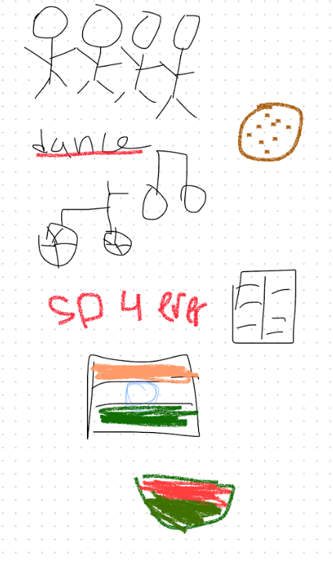
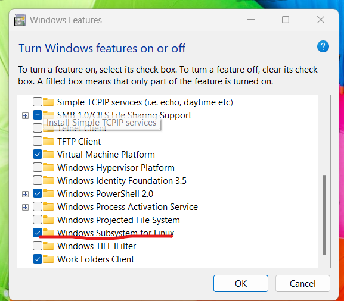
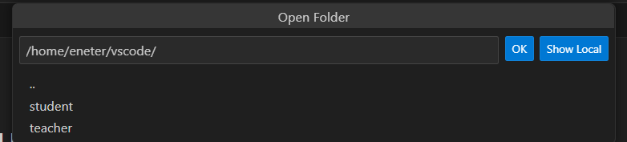

#  Eshika Pallapotu 

###  Hi, my name is Eshika Pallapotu and I am 15 years old. I was born on March 4th and I got to Del Norte High school. I love to learn about science and hope to persue it in the future. I have a family of four, including me, and we are very close. Fun fact: I am the oldest out of all of my first cousins and they all live in the US. 

###  This image shows various of things about me. My parent are from India but I was born and brought up in San diego. In this image, it shows a bike, indicating that I love to go on bike rides! My favorite foods are cookies and watermelons. As a sport, I do an Indian classical dancing known as Bharatanatyam. I enjoy reading and listening to music in my freetime. 

#### In order to make this blog, I went through many obstacles. For me, I struggled from the begining itself. Unable to open wsl, I turned to my peers who faced similar issues. I then was introduced to a setting known as features. So in order to support linux, I added a box and was good to go. Another interesting thing that occured was that my teacher and student repository was merged and after consulting with a student coach, I learned that it shouldn't give me many problems. I however, don't know if that is related to the issue of unable to find the teacher repository in my vscode file. I overcame that problem and was able to catch up and sucessfully finish setting up. 

## 
